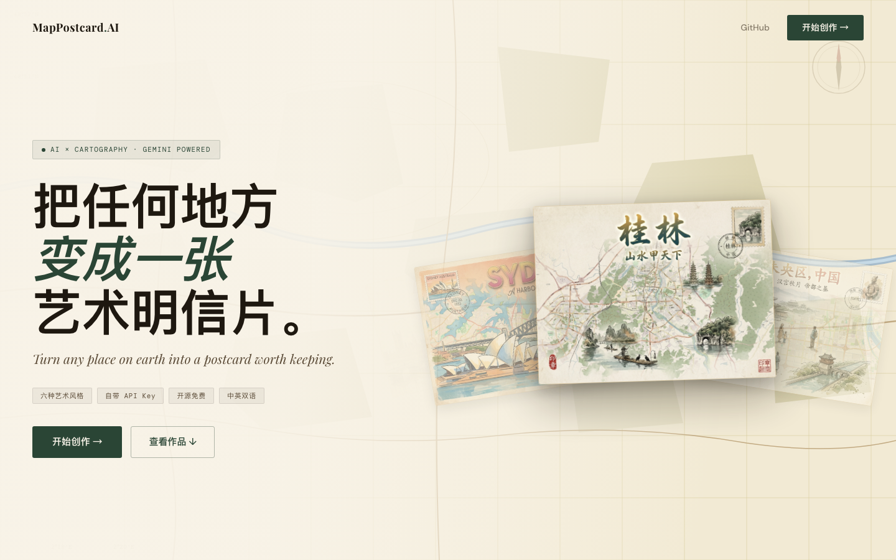
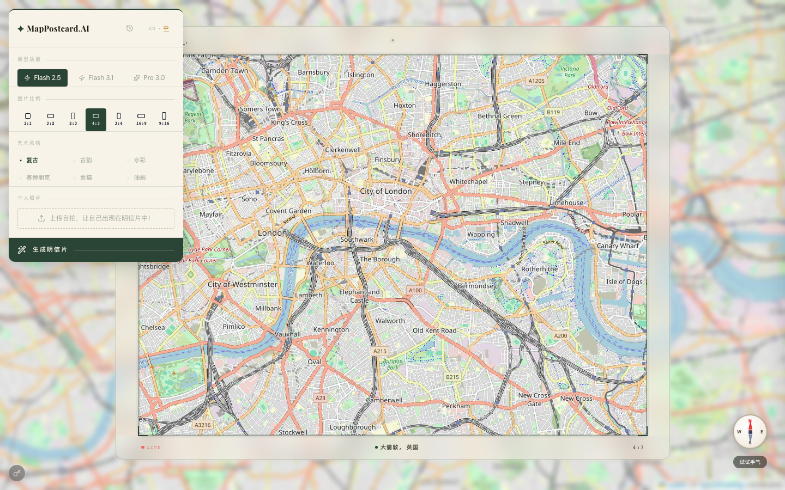
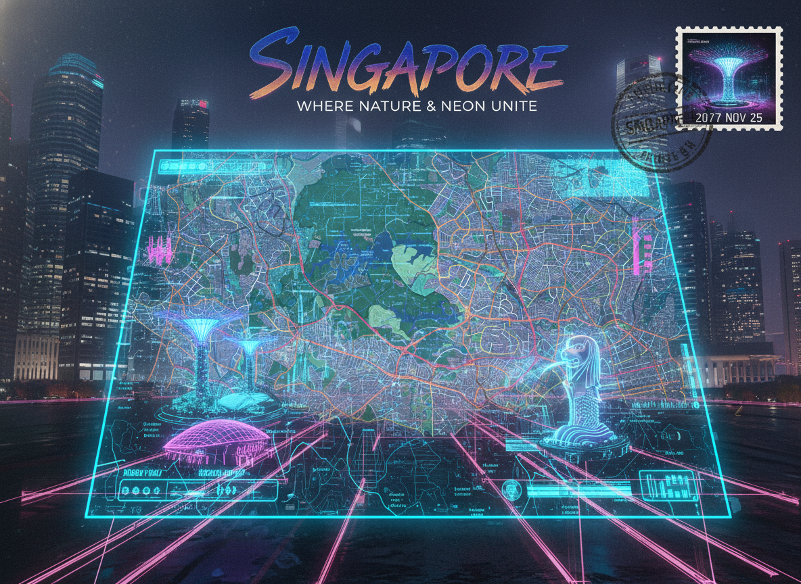

<div align="center">

# MapPostcard AI

**将地图上的任意位置转化为 AI 手绘明信片**

[English](./README.md) · [在线体验](https://postcard-map-ai.vercel.app) · [反馈问题](https://github.com/Aryous/PostcardMapAI/issues)

[](./LICENSE)
[](https://postcard-map-ai.vercel.app)
[](https://react.dev)
[](https://aistudio.google.com)
[](https://aistudio.google.com)
[](https://aistudio.google.com)

</div>

---

## 界面截图

| 落地页 | 地图编辑 | 明信片集 |
|:---:|:---:|:---:|
|  |  |  |

## 功能特性

- **随意探索** — 拖动地图到世界任意角落，通过反向地理编码自动识别地名
- **3 种 AI 模型** — 可在 Nano Banana、Nano Banana 2、Nano Banana Pro 之间切换（详见[模型说明](#模型说明)）
- **6 种艺术风格** — 水彩、复古、素描、油画、古韵、赛博朋克
- **7 种画幅比例** — 1:1、4:3、3:4、16:9、9:16、3:2、2:3
- **明信片背面** — 与正面风格匹配的背面同步生成
- **上传照片** — 把自己加入场景，AI 以明信片画风重新绘制你的形象
- **明信片集** — 生成的明信片收集在悬浮活页本面板中，仅限本次会话（刷新后清空）
- **随机探索** — 罗盘按钮随机跳转城市 + 随机风格，一键获取灵感
- **费用估算** — 每次生成后显示 token 用量和预估 USD 费用

## 模型说明

| 名称 | 模型 ID | 速度 | 质量 | 免费额度 |
|------|---------|------|------|----------|
| Nano Banana | `gemini-2.5-flash-image` | 快 | 好 | 支持 |
| Nano Banana 2 | `gemini-3.1-flash-image-preview` | 快 | 更好 | 支持 |
| Nano Banana Pro | `gemini-3-pro-image-preview` | 慢 | 最佳 | 不支持，需付费 API Key |

> 费用基于 token 数量 × [Google AI 公开定价](https://ai.google.dev/pricing) 估算，实际账单以 Google 为准。

## 演示案例

| | | |
|:---:|:---:|:---:|
|  |  |  |
| **水彩** · 巴塞罗那 | **油画** · 伦敦 | **古韵** · 桂林 |
|  |  |  |
| **复古** · 东京 | **素描** · 成都 | **赛博朋克** · 新加坡 |

## 本地运行

**前置条件：** Node.js 18+

```bash
git clone https://github.com/Aryous/PostcardMapAI.git
cd PostcardMapAI
npm install
npm run dev
```

打开 [http://localhost:3000](http://localhost:3000) 即可使用。

> **API Key：** 免费申请：[aistudio.google.com/apikey](https://aistudio.google.com/apikey)
> 可直接在应用内（左下角钥匙图标）输入，无需修改任何配置文件。

或者创建 `.env.local` 文件：

```
GEMINI_API_KEY=你的Key
```

## 部署到 Vercel

### 一键部署

[](https://vercel.com/new/clone?repository-url=https://github.com/Aryous/PostcardMapAI)

部署完成后，在 **Settings → Environment Variables** 添加：

| 变量名 | 值 |
|--------|----|
| `GEMINI_API_KEY` | 你的 Gemini API Key（可选——用户也可在应用内自行输入） |

### CLI 部署

```bash
npm i -g vercel
vercel login
vercel --prod
```

### 连接 GitHub（推荐）

1. 将本仓库推送至你的 GitHub 账号
2. 访问 [vercel.com/new](https://vercel.com/new) 导入仓库
3. 可选添加 `GEMINI_API_KEY` 环境变量
4. 之后每次推送到 `main` 分支均自动部署

## 技术栈

- **React + TypeScript + Vite**
- **Leaflet** — 交互式地图
- **Google Gemini API** — 基于 Nano Banana（`gemini-2.5-flash-image`）、Nano Banana 2（`gemini-3.1-flash-image-preview`）和 Nano Banana Pro（`gemini-3-pro-image-preview`）的多模型图像生成
- **html2canvas** — 地图截图
- **Nominatim** — 反向地理编码（OpenStreetMap）
- **Tailwind CSS**（CDN 引入）

## 已知限制

- **明信片集仅限本次会话** — 刷新页面后记录消失，不做持久化存储
- **Nano Banana Pro 需付费 API Key** — 免费 Key 调用 `gemini-3-pro-image-preview` 会返回 403 错误
- **地图瓦片 CORS** — 截图依赖瓦片服务允许 CORS，部分自定义图层可能截图空白
- **费用为估算值** — 基于 token 数量计算，非 Google 实际账单数据

---

<div align="center">
  <sub><a href="https://postcard-map-ai.vercel.app">postcard-map-ai.vercel.app</a></sub>
</div>
